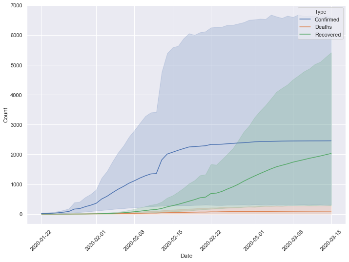
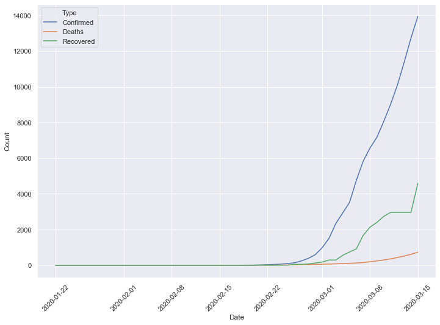
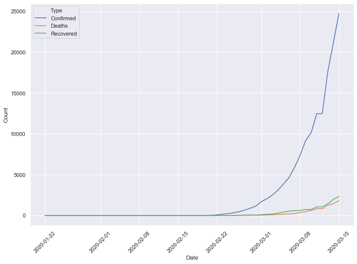
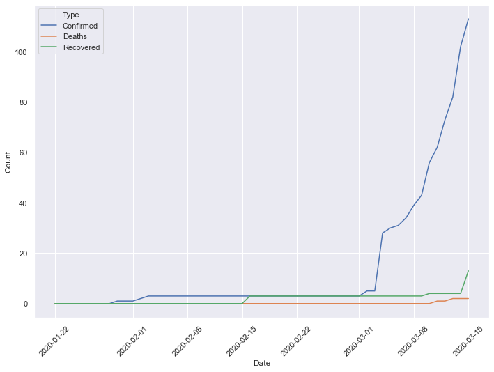

# COVID_19_Analysis

Analysis of COVID_19  data set to find confirmed cases, deaths , recovered cases in top affected countries

## Dataset source : KAGGLE(COVID-19 Complete Dataset (Updated every 24hrs))
## Dataset link : https://www.kaggle.com/imdevskp/corona-virus-report

## OUTPUT Plots : 

### China 

### Iran

### Italy

### USA

### India

